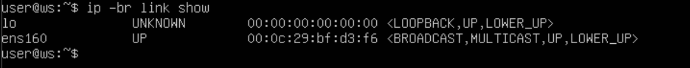
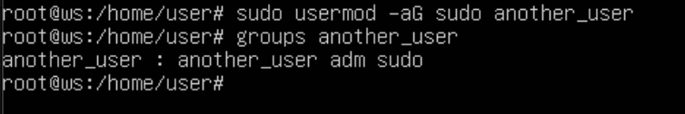
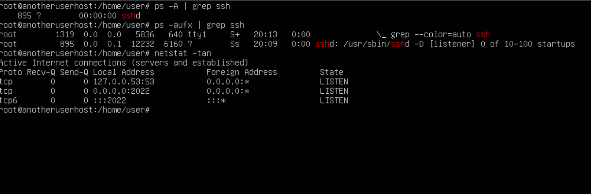
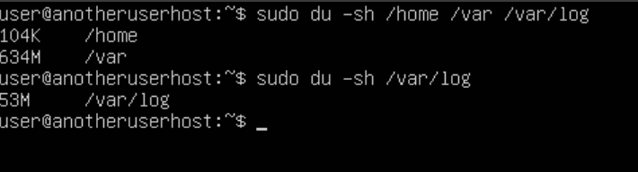
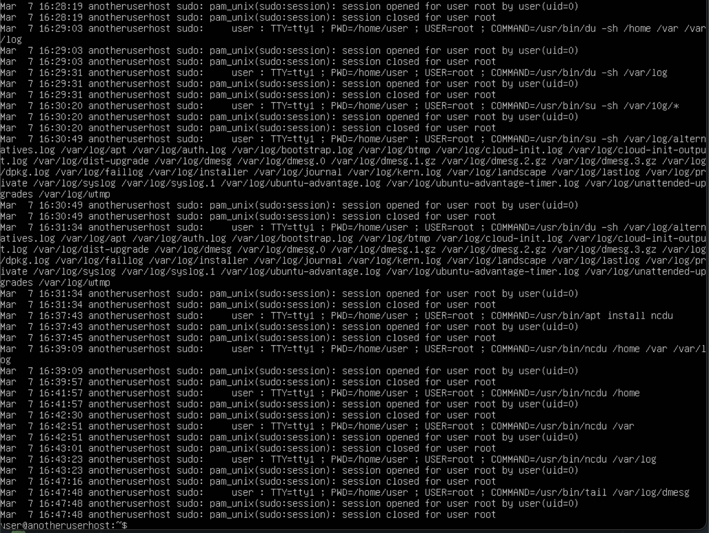
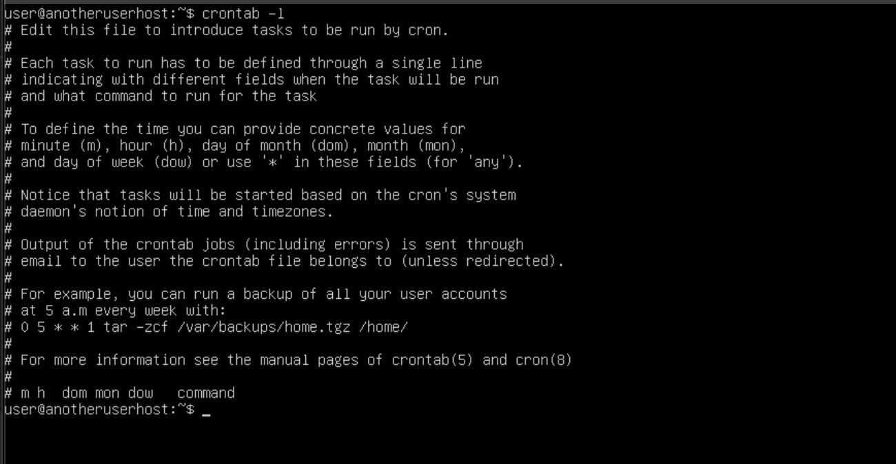

## Part 1. Установка OC
**== Выполнение ==**

## Part 2. Создание пользователя
**== Выполнение ==**

-  Создаю нового пользователя another_user командой `sudo adduser another_user`

-  Добавляю another_user в группу adm командой `sudo usermod -a -G adm another_user`

-  Выполнение команды `cat /etc/passwd`

## Part 3. Настройка сети  OC
**== Выполнение ==**

-  Задаю имя хоста командой `sudo hostname user-1`

-  Устанавливаю временную зону

-  Вывожу названия сетевых интерфейсов командой `ip -br link show`

>Интерфейс "lo" (loopback device) представляет собой виртуальный сетевой интерфейс в операционных системах Unix/Linux. Он используется для обратной связи на уровне сетевого стека. Этот интерфейс обычно имеет адрес "127.0.0.1", который также известен как "localhost".

-  Вывожу полученный ip-адрес устройства от DHCP сервера командой `sudo dhclient -v`

>DHCP расшифровывается как "Dynamic Host Configuration Protocol" (Протокол динамической конфигурации узла). DHCP - это протокол сетевого уровня, который используется для автоматической настройки сетевых параметров устройствам в сети. Эти параметры могут включать IP-адрес, шлюз по умолчанию, адрес DNS-сервера и другие параметры, необходимые для подключения к сети и обмена данными в ней.

-  Вывожу внешний и внутренний ip-адрес шлюза командами `curl icanhazip.com` и `hostname -I` соответственно

- Задаю статичные настройки ip, gw, dns, используя публичный DNS сервер

- Открою файл статической конфигурации YAML в текстовом редакторе: `sudo nano /etc/netplan/00-installer-config.yaml` и приведу его к необходимому виду

- Чтобы применить изменения выполню `sudo network apply`

- Проверяю, что интерфейс настроен на использование статического ip-адреса командой `ip route show`

- Перезапускаю виртуальную машину и проверяю, что файл с сетевыми настройками не изменился

- Пингую удаленные хосты 1.1.1.1 и ya.ru

## Part4. Обновление OC
**== Выполнение ==**

- Обновил системные пакеты до последней версии

## Part 5. Использование команды sudo
**== Выполнение ==**

> Команда sudo (от английского "Superuser Do") в Linux и других UNIX-подобных операционных системах используется для выполнения команд от имени суперпользователя (root) или другого пользователя, обладающего правами администратора.

> Назначение команды sudo заключается в том, чтобы предоставить временный доступ к привилегированным командам без необходимости постоянного входа в систему в качестве суперпользователя. Это повышает безопасность системы, так как ограничивает доступ к привилегированным операциям только для тех, кто имеет соответствующие права.

- Разрешу пользователю `another_user` выполнять команду `sudo` с помощью `sudo usermod -aG sudo another_user`

- Измененный `hostname`

## Part 6. Установка и настройка службы времени
**== Выполнение ==**

- Включу синхронизацию командой `set-ntp on`
- Выведу время и дату моего часового пояса

## Part 7. Установка и использование текстовых редакторов
**== Выполнение ==**

- Запишу свой никнейм в редакторах vim, nano, joe

<b> VIM

Для выхода нажал `shift + :`, затем ввел `wq`

NANO

Для выхода нажал `Ctrl + O`, затем `Ctrl + X`

JOE

Для выхода нажал `Ctrl + K`, затем `Ctrl + X`
</b>

- Доказательства сохранения:

- Отредактирую файл, заменив никнейм на "21 School 21", закрою без сохранения

<b> VIM

Для выхода без сохранения нажал `shift + :`, затем впишу `q!`

NANO

Для выхода без сохранения нажал `Ctrl + X`, затем `N` 

JOE

Для выхода без сохранения нажал `Ctrl + C`, затем `Y`
</b>

- Отредактирую файл еще раз и заменю слово функцией поиска по содержимому

<b> VIM

Для поиска и замены ввожу `:s/слово/замена`

NANO

Для поиска и замены ввожу `Ctrl + W`, затем `Ctrl + \`

JOE

Для поиска и замены ввожу `Ctrl + K + F`, затем `Ctrl + R + слово`
</b>
## Part 8. Установка и базовая настройка сервиса SSHD
**== Выполнение ==**

- Устанавливаю SSH командой `sudo apt-get install ssh`, затем включаю его `sudo systemctl enable ssh`

- Проверю, что SSHd работает

- Поменяю Port на 2022 и уберу `#`, чтобы раскомментировать строку, затем перезапущу SSH командой `sudo systemctl restart ssh`

- Показываю наличие процесса sshd, проверяю запущен ли ssh-демон
- Делаю `reboot` и `netstat -tan`

> Команды ps и grep используются для работы с процессами в системе.

1. ps: Это команда, которая используется для вывода информации о текущих процессах в системе.
2. -A: Этот ключ для ps указывает команде выводить информацию о всех процессах в системе.
3. | : Это символ "pipe", который используется для передачи вывода одной команды на вход другой команде.
4. grep: Эта команда используется для фильтрации строк на основе заданного шаблона.
5. ssh: Это шаблон, по которому grep фильтрует вывод ps, чтобы найти строки, содержащие текст "ssh".

> Таким образом, команда `ps -A | grep ssh` выводит информацию о всех процессах в системе, а затем фильтрует строки, оставляя только те, которые содержат "ssh".

> Команда `netstat` работает вместе с командой `ifconfig` и служит для отображения состояния сетевого интерфейса TCP/IP:
1. -a - Отображение всех подключений и ожидающих портов. \
2. -n - Отображение адресов и номеров портов в числовом формате. \
3. -t - Отображение текущего подключения в состоянии переноса нагрузки процессора на сетевой адаптер при передаче данных ( "offload" ).
> 0.0.0.0 - это специальный IP-адрес, который означает “любой IP-адрес”. Он используется в настройках сетевых программ, когда нужно указать “любой IP-доступ”, “все IP-адреса” или “локальный хост”. Например, если серверу нужно принимать соединения от любого IP-адреса, он может быть настроен на 0.0.0.0, тогда как фактическому IP-адресу клиента будет присваиваться адрес при подключении.

## Part 9. Установка и использование утилит top, htop
**== Выполнение ==**

- Установлю htop командой `sudo apt install htop`

- Вывод команды `top`

1. uptime: 45 min
2. users: 1
3. загрузка системы: 0.00, 0.03, 0.05
4. количество процессов: 196
5. загрузка cpu: 0.0us, 0.2sy, 0.0ni, 99.8id, 0.0wa, 0.0hi, 0.0si, 0.0st
6. pid процесса, занимающего больше всего памяти: 1530 
7. pid процесса, занимающего больше всего процессорного времени: 2161

- Вывод команды `htop`
1. Отсортированный по PID

2. Отсортированный по PERCENT_CPU

3. Отсортированный по PERCENT_MEM

4. Отсортированный по TIME

5. Отфильтрованный для процесса sshd

6. С процессом syslog, найденным, используя поиск

7. С добавленным выводом hostname, clock и uptime `echo "Hostname: $(hostname)" && echo "Current Time: $(date)" && echo "HTOP Output:" && htop`

## Part 10. Использование утилиты fdisk
**== Выполнение ==**

- Вывод команды `fdisk -l`

1. Название жесткого диска: /dev/mapper/ubuntu--vg-ubuntu-lv
2. Размер жесткого диска: 10GiB
3. Количество секторов жесткого диска: 20971520
4. Размер swap: 10GiB

## Part 11. Использование утилиты df
**== Выполнение ==**

- Вывод команд `df` и `df -Th`

- Для `df`:
1. Размер раздела: 10218772Kb
2. Размер занятого пространства: 3136412Kb
3. Размер свободного пространства: 6541688Kb
4. Процент использования: 33%
5. Единица измерения: Kb

- Для `df -Th`
1. Размер раздела: 9,8G
2. Размер занятого пространства: 3.0G
3. Размер свободного пространства: 6.3G
4. Процент использования: 33%
5. Тип файловой системы: ext4

## Part 12. Использование утилиты du
**== Выполнение ==**

- Вывод команды `du -sh` для `/home /var /var/log`

- Вывод команды `du -sh` для `/var/log/*`

## Part 13. Установка и использование утилиты ncdu
**== Выполнение ==**

- Устанавливаю утилиту `ncdu`

- Вывод размера папки `/home`

- Вывод размера папки `/var`

- Вывод размера паки `/var/log`

## Part 14. Работа с системными журналами
**== Выполнение ==**

- Открою `/var/log/dmesg`

- Открою `/var/log/syslog`

- Открою `/var/log/auth.log`

- Рестарт службы SSHd

## Part 15. Использование планировщика заданий CRON
**== Выполнение ==**

- Открою `crontab` командой `crontab -e`, выбрав в качестве редактора NANO
- Добавлю строку `*/2 * * * * uptime` в конец файла, чтобы запускать команду `uptime` каждые 2 минуты

- Включу `CRON` и запущу его

- Строчки о выполнении из системного журнала:

- Список текущих заданий для `CRON`

- Список заданий для `CRON` после их удаления

